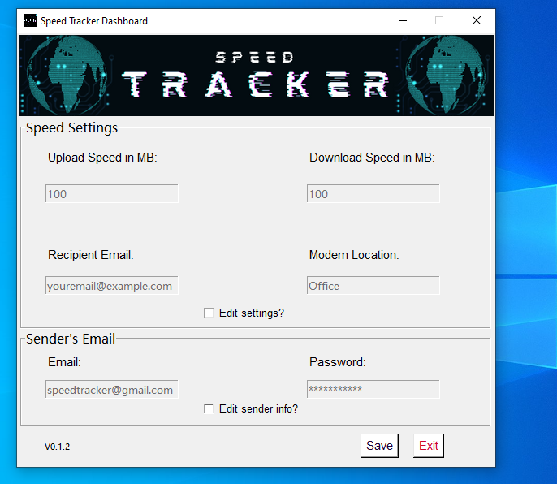

<body>
<h1>WELCOME TO SPEED TRACKER V0.1.2</h1>

<h2>Supported Email Provider</h2>

    - @gmail.com
    - 
    - 

<h1>Dashboard</h1>

<h2>How to use Speed Tracker</h2>

You will first need to launch the Speed Tracker dashboard.
You should see a start screen when launching the dashboard for the
first time.

<a href="https://www.youtube.com/watch?v=c2h0Tvu2El4"> Watch the Youtube Video here</a>

<h4>Why Speed Tracker was created?</h4>

I am working from home for a contact center.
The company requires us to do a speed test 30 minutes before our shift starts,
so I decided after the first month of doing this speed test manually.

I asked my self why not create a python script to automate it?

The plan was to use a <a href="https://en.wikipedia.org/wiki/Raspberry_Pi#:~:text=The%20Raspberry%20Pi%204%20Model,HDMI%20(HDMI%20Type%20D)%20ports">Raspberry Pi</a> which would be connected to the modem via ethernet.
Then I would create a schedule for the script, which would run in the background every hour tracking the
internet speed, then send me an email if the upload and download speed is below a pre-define limits.

</body>
