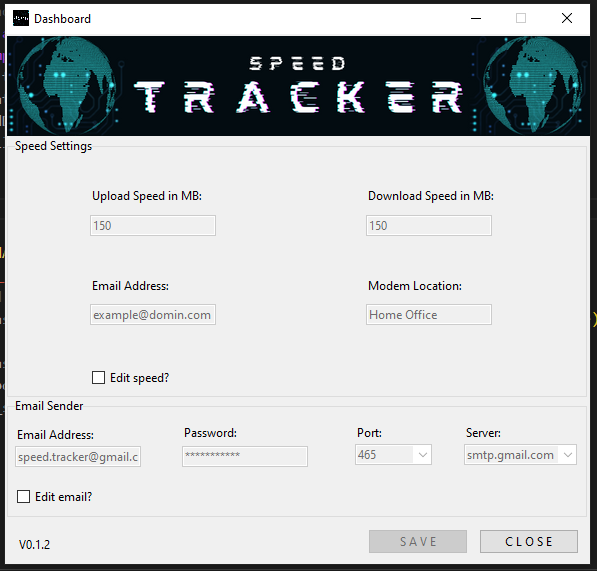

<body>

<h1>SPEED TRACKER V0.1.2</h1>
<h2>Project is currently under development</h2>

<h3>Dashboard Design</h3>

<h3>How To Use Speed Tracker</h3>

<h5>STEP 1:</h5>
First you will need to open the Speed Tracker dashboard,
if the entries in the dashboard is the same as the screenshot above,
you will need to change those entries to your liking by doing the following:

<h5>STEP 2:</h5>
Click on any of the two edit checkboxes, then change each entry.
Note before unchecking any of the boxes you must select the save button
to store your entires.

<h5>STEP 3:</h5>
Now you will need to create a schedular with 'Task Scheduler'.
<a href="https://www.youtube.com/channel/UCg6m_8coxXFFPdzF4B7tN_Q/featured">How to use task Scheduler</a>

 
 

<h3>Edit Speed Settings & More:</h3>
 
 
 

<h3>Edit Email Sender Settings:</h3>
 

 
 

<h3>Both Check buttons Selected:</h3>
 

 
 
 

<h4>Why Speed Tracker was created?</h4>

I am working from home for a contact center.
The company requires us to do a speed test 30 minutes before our shift starts,
so I decided after the first month of doing this speed test manually.

I asked my self why not create a python script to automate it?

The plan was to use a <a href="https://en.wikipedia.org/wiki/Raspberry_Pi#:~:text=The%20Raspberry%20Pi%204%20Model,HDMI%20(HDMI%20Type%20D)%20ports">Raspberry Pi</a> which would be connected to the modem via ethernet.
Then I would create a schedule for the script, which would run in the background every hour tracking the
internet speed, then send me an email if the upload and download speed is below a pre-define limits.

</body>
